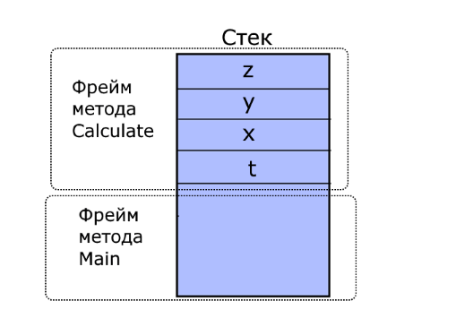
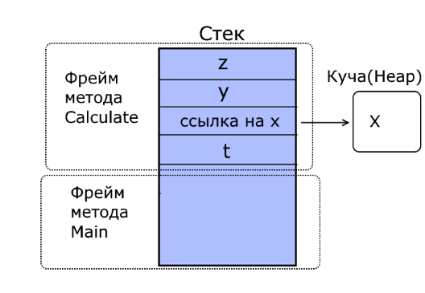

# Справочник по C#

## <a name="up">Содержание</a>

* Полезные ссылки
* Особенности C#
* [Примитивные типы данных](#tag1)
* [Неявная типизация](#tag2)
* [Преобразования типов данных](#tag3)
* [Массивы](#tag4)
* [Многомерные массивы](#tag5)
* [Массив массивов](#tag6)
* [Функции](#tag7)
* [Модификатор out](#tag8)
* [Необязательные параметры](#tag9)
* [Именованные параметры](#tag10)
* [Массив параметров params](#tag11)
* [Перечисления enum](#tag12)
* [Структуры struct](#tag13)
* [Кортежи (работа с набором значений)](#tag14)
* [Обработка исключений](#tag15)
* [Обработка нескольких исключений](#tag16)
* [Оператор throw](#tag17)
* [Фильтры исключений](#tag18)
* [Переменные-ссылки и возвращение ссылки](#tag19)
* [Классы в C#](#tag20)
* [Ключевое слово this](#tag21)
* [Инициализаторы объектов](#tag22)
* [Модификаторы доступа](#tag23)
* [Константы и поля для чтения](#tag24)
* [Свойства и инкапсуляция](#tag25)
* [Инкапсуляция](#tag26)
* [Автоматические свойства](#tag27)

## Полезные ссылки

* [Сайт о программировании Metanit.com](https://metanit.com/sharp/)
* [Руководство по C# Microsoft](https://docs.microsoft.com/ru-ru/dotnet/csharp/index)
* [Видео уроки Metanit](https://www.youtube.com/playlist?list=PLL-k0Ff5RfqXGhAooRkUpzMLd6_Fpr13I)

## Особенности C#

### <a name="tag1">Примитивные типы данных</a> - [содержане](#up)

* ***bool*** (true | false) - **System.Boolean**
* ***byte*** (цеслое число от 0 до 255) - 1 байт **System.Byte**
* ***sbyte*** (целое число от -128 до 127) - 1 байт **System.SByte**
* ***short*** (целое число от -32768 до 32767) - 2 байта **System.Int16**
* ***ushort*** (целое число от 0 до 65535) - 2 байта **System.UInt16**
* ***int*** (целые числа по умолчанию -2147483648 до 2147483647) 4 байта **System.Int32**
* ***uint*** (от 0 до 4294967295U) 4 байта **System.UInt32**
* ***long*** (от -9 223 372 036 854 775 808L до 9 223 372 036 854 775 807L ) 8 байт **System.Int64**
* ***ulong*** (от 0 до 18 446 744 073 709 551 615UL) 8 байт **System.UInt64**
* ***float*** (числа с плавающей точкой от -3.4\*10в38f до 3.4\*10в38f) 4 байта **System.Single**
* ***double*** (числа с плавающей точкой от 5.0\*10в-324 до 1.7\*10в308) 8 байт **System.Double**
* ***decimal*** (десятичное дробное число, если без запятой то от 0 до +/–79 228 162 514 264 337 593 543 950 335m; если с запятой, то от 0 до +/–7,9228162514264337593543950335M с 28 разрядами после) 16 байт **System.Decimal**
* ***char*** (хранит одиночный символ Unicode) 2 байта **System.Char**
* ***string*** (хранит набор символов Unicode) **System.String**
* ***object*** (значение любого типа данных) 4 байта на х32 и 8 байт на х64 **System.Object**(базовый для всех других типов и классов .NET)

### <a name="tag2">Неявная типизация</a> - [содержане](#up)
Вместо названия типа данных используется ключевое слово **var**. Компилятор сам выводит тип данных исходя из присвоенного значения.
``` C#
var hello = "Hell to World"; // hello = string
var c = 20; // c = int
```

### <a name="tag3">Преобразования типов данных</a> - [содержане](#up)
Преобразования могут быть:
1. сужающие(narrowing)
2. расширяющие(widering)  
Расширяющие преобразования расширяют размер объекта в памяти и наоборот.

Компилятор может проводить неявные преобразования в след. случаях:
byte -> short -> int -> long -> decimal  
int -> double  
short -> float -> double  
char -> int  
В остальных случаях необходимо использовать явное преобразование:
``` C#
int x = (int)numb;
float y = (float)numb;
byte c = (byte)(a+b);
```

## <a name="tag4">Массивы</a> - [содержане](#up)

### Стандартный массив

``` C#
int[] numbers; // массив целых чисел
int[] nums  = new int[4]; // задаем массиву размерность в 4 элемента
// Также мы сразу можем указать значения для элементов
int[] nums2 = new int[] { 1, 2, 3, 5 };
```

### Перебор массивов. Цикл foreach
``` C#
foreach (тип_данных название_переменной in контейнер)
{
    // действия
}
```
Например:
``` C#
int[] numbers = new int[] { 1, 2, 3, 4, 5 };
foreach (int i in numbers)
{
    Console.WriteLine(i);
}
```

### <a name="tag5">Многомерные массивы</a> - [содержане](#up)
Двухмерный массив:  
`int[,] nums2 = { { 0, 1, 2 }, { 3, 4, 5 } };`

Трехмерный массив:  
`int[,,] nums3 = new int[2, 3, 4];`

Способы определения двухмерных массивов:
``` C#
int[,] nums1;
int[,] nums2 = new int[2, 3];
int[,] nums3 = new int[2, 3] { { 0, 1, 2 }, { 3, 4, 5 } };
int[,] nums4 = new int[,] { { 0, 1, 2 }, { 3, 4, 5 } };
int[,] nums5 = new [,]{ { 0, 1, 2 }, { 3, 4, 5 } };
int[,] nums6 = { { 0, 1, 2 }, { 3, 4, 5 } };
```

Перебор двухмерного массива:  
``` C#
int[,] mas = { { 1, 2, 3 }, { 4, 5, 6 }, { 7, 8, 9 }, { 10, 11, 12 } };
 
int rows = mas.GetUpperBound(0) + 1;
int columns = mas.Length / rows;
 
for (int i = 0; i < rows; i++)
{
    for (int j = 0; j < columns; j++)
    {
        Console.Write($"{mas[i, j]} \t");
    }
    Console.WriteLine();
}
```

### <a name="tag6">Массив массивов</a> - [содержане](#up)
От многомерных массивов надо отличать массив массивов или так называемый "зубчатый массив":
``` C#
int[][] nums = new int[3][];
nums[0] = new int[2] { 1, 2 };          // выделяем память для первого подмассива
nums[1] = new int[3] { 1, 2, 3 };       // выделяем память для второго подмассива
nums[2] = new int[5] { 1, 2, 3, 4, 5 }; // выделяем память для третьего подмассива
```

## <a name="tag7">Функции</a> - [содержане](#up)

### Общий вид
Общее определение методов выглядит следующим образом:
``` C#
[модификаторы] тип_возвращаемого_значения название_метода ([параметры])
{
    // тело метода
}
```

### Параметры функций
Передача параметров может быть *по значению* и *по ссылке*:
1. По значению : `void func(int a, float b);`
2. По ссылке : `void func(ref int a, ref float b);`

При передаче по ссылке используется ключевое слово ***ref*** перед типом параметра.

### <a name="tag8">Модификатор out</a> - [содержане](#up)
Параметры в C# могут быть также выходными. Чтобы сделать параметр выходным перед ним ставится модификатор out:
``` C#
static void Sum(int x, int y, out int a)
{
    a = x + y;
}
Sum(x, 15, out z);
```
* Причем, как и в случае с ref ключевое слово out используется как при определении метода, так и при его вызове.  
* Также обратите внимание, что методы, использующие такие параметры, обязательно должны присваивать им определенное значение!
``` C#
static void Sum(int x, int y, out int a)
{
    a = //... а обязательно должно быть чему то равно 
}
```

### <a name="tag9">Необязательные параметры</a> - [содержане](#up)
С# позволяет использовать необязательные параметры. 
* Для таких параметров необходимо объявить значение по умолчанию
* После необязательных параметров все последующие параметры также должны быть необязательными
``` C#
static int OptionalParam(int x, int y, int z=5, int s=4)
{
    return x + y + z + s;
}
OptionalParam(2, 3); // Всего 2 входных параметра z=5 s=4
OptionalParam(2, 3, 10); // 3 входных параметра z=10 s=4
```

### <a name="tag10">Именованные параметры</a> - [содержане](#up)
При вызове методов значения для параметров передаются в порядке их объявления в методе. Но мы можем нарушить подобный порядок, используя именованные параметры:
``` C#
static int OptionalParam(int x, int y, int z=5, int s=4)
{
    return x + y + z + s;
}
static void Main(string[] args)
{
    OptionalParam(x:2, y:3);
     
    //Необязательный параметр z использует значение по умолчанию
    OptionalParam(y:2,x:3,s:10);
 
    Console.ReadLine();
}
```

### <a name="tag11">Массив параметров params</a> - [содержане](#up)
Используя ключевое слово *params*, мы можем передавать неопределенное количество параметров:
``` C#
static void Addition(params int[] integers)
{
    int result = 0;
    for (int i = 0; i < integers.Length; i++)
    {
        result += integers[i];
    }
    Console.WriteLine(result);
}

Addition(1, 2, 3, 4, 5);
 
int[] array = new int[] { 1, 2, 3, 4 };
Addition(array);

Addition();

```
Причем на место параметра с модификатором *params* мы можем передать как отдельные значения, так и массив значений, либо вообще не передавать параметры.
* **Важно!** Массив параметров *params* нужно всегда указывать последним!

### <a name="tag12">Перечисления enum</a> - [содержане](#up)
В C# есть такой тип данных как **enum** или перечисление. Представляет из себя набор логически связанных констант. 
* Перечисление обязательно должно представлять целочисленный тип (byte, int, short, long)
* Если тип не указан, используется int.
``` C#
enum Days // неявный тип int
{
    Monday, // По умолчанию первый элемент = 0
    Tuesday, // Каждый следующий увеличивается на 1
    Wednesday, // 2
    Thursday, // 3
    Friday, // 4
    Saturday, // 5
    Sunday // 6
}
  
enum Time : byte // явный тип byte
{
    Morning = 3, // Мы можем явно указать первый
    Afternoon, // 4
    Evening, // 5
    Night // 6
}

enum Operation // неявный тип int
{ 
    Add = 2, // Либо задать значения каждого элемента явным образом
    Subtract = 4,
    Multiply = 8,
    Divide = 16
}
```

* Каждое перечисление фактически определяет новый тип данных.
* Мы можем определить переменную этого типа и использовать ее
``` C#
enum Operation // неявный тип int
{ 
    Add = 2,
    Subtract = 4,
    Multiply = 8,
    Divide = 16
}
Operation op;
op = Operation.Add;
```
* Несмотря на то, что каждая константа сопоставляется с определенным числом, мы не можем присвоить ей числовое значение.
* И также если мы будем выводить на консоль значение этой переменной, то мы получим имя константы, а не числовое значение.

Применение перечисления на примере:
``` C#
class Program
{
    enum Operation
    {
        Add = 1,
        Subtract,
        Multiply,
        Divide
    }
 
    static void MathOp(double x, double y, Operation op)
    {
        double result = 0.0;
 
        switch (op)
        {
            case Operation.Add:
                result = x + y;
                break;
            case Operation.Subtract:
                result = x - y;
                break;
            case Operation.Multiply:
                result = x * y;
                break;
            case Operation.Divide:
                result = x / y;
                break;
        }
 
        Console.WriteLine("Результат операции равен {0}", result);
    }
 
    static void Main(string[] args)
    {
        // Тип операции задаем с помощью константы Operation.Add, которая равна 1
        MathOp(10, 5, Operation.Add);
        // Тип операции задаем с помощью константы Operation.Multiply, которая равна 3
        MathOp(11, 5, Operation.Multiply);
             
        Console.ReadLine();
    }  
}
```

### <a name="tag13">Структуры struct</a> - [содержане](#up)
В C# имеется и составной тип данных, который называется структурой. Структуры могут содержать в себе обычные переменные и методы:
``` C#
struct Book
{
    public string name;
    public string author;
    public int year;
 
    public void Info()
    {
        Console.WriteLine($"Книга '{name}' (автор {author}) была издана в {year} году");
    }
}
```
* Может содержать конструктор для инициализации начальных значений переменных:  
``` C#
Book book2 = new Book(); // использование конструктора
```
Вызов конструктора имеет следующий синтаксис: `new название_структуры ([список_параметров])`

### <a name="tag14">Кортежи (работа с набором значений)</a> - [содержане](#up)
Кортеж представляет набор значений, заключенных в круглые скобки:
``` C#
var tuple = (5, 10);
```
* Кортеж tuple имеет два значения: 5 и 10. Мы можем обращаться к ним через Item[n]:
``` C#
tuple.Item1 += 25;
tuple.Item2 = 10 + tuple.Item1;
```
* Для переменных кортежа можно указывать явный тип переменных:
``` C#
(int, int) tuple = (5, 10);
(string, int, double) person = ("Tom", 25, 81.23);
```
* Мы также можем дать названия полям кортежа:
``` C#
var tuple = (count:5, sum:10);
Console.WriteLine(tuple.count); // 5
Console.WriteLine(tuple.sum); // 10
```
* Мы даже можем не использовать переменную для определения всего кортежа, а использовать отдельные переменные для его полей:
``` C#
var (name, age) = ("Tom", 23);
Console.WriteLine(name);    // Tom
Console.WriteLine(age);     // 23
```

* Кортежи можно использовть для возвращения из функций более одного значения:
``` C#
private static (int, int) GetValues()
{
    var result = (1, 3);
    return result;
}
```
* И также кортеж может передаваться в качестве параметра в метод:
``` C#
private static (string name, int age) GetTuple((string n, int a) tuple, int x)
{
    var result = (name: tuple.n, age: tuple.a + x);
    return result;
}
var (name, age) = GetTuple(("Tom", 23), 12);
```

## <a name="tag15">Обработка исключений</a> - [содержане](#up)
Язык C# предоставляет разработчикам возможности для обработки исключений с помощью конструкции **try...catch...finally**. 
* При возникновении исключения среда CLR ищет блок catch, который может обработать данное исключение. 
* Далее в любом случае выполняется блок finally, но его использовать не обязательно.
``` C#
try
{
    a[5] = 4; // тут возникнет исключение, так как у нас в массиве только 4 элемента
    Console.WriteLine("Завершение блока try");
}
catch (Exception ex)
{
    Console.WriteLine("Ошибка: " + ex.Message);
}
finally
{
    Console.WriteLine("Блок finally");
}
```

### <a name="tag16">Обработка нескольких исключений</a> - [содержане](#up)
При необходимости мы можем разграничить обработку различных типов исключений, включив дополнительные блоки catch:
``` C#
static void Main(string[] args)
{
try
{
    //...
}
catch (FileNotFoundException e)
{
    // Обработка исключения, возникшего при отсутствии файла
}
catch (IOException e)
{
    // Обработка исключений ввода-вывода
}
Console.ReadLine();
}
```

### <a name="tag17">Оператор throw</a> - [содержане](#up)
C помощью throw мы сами можем создать исключение и вызвать его в процессе выполнения.
``` C#
try
{
    string message = Console.ReadLine();
    if (message.Length > 6)
    {
        throw new Exception("Длина строки больше 6 символов");
    }
}
catch (Exception e)
{
    Console.WriteLine("Ошибка: " + e.Message);
}
```

### <a name="tag18">Фильтры исключений</a> - [содержане](#up)
Фильтры позволяют обрабатывать исключения в зависимости от определенных условий:
``` C#
try
{
    int result = x / y;
}
catch(Exception ex) when (y==0)
{
    Console.WriteLine("y не должен быть равен 0");
}
catch(Exception ex)
{
    Console.WriteLine(ex.Message);
}
```

### <a name="tag19">Переменные-ссылки и возвращение ссылки</a> - [содержане](#up)
* Для определения локальной переменной-ссылки (ref local) перед ее типом ставится ключевое слово ref:
``` C#
int x = 5;
ref int xRef = ref x;
```
Здесь переменная xRef указывает не просто на значение переменной x, а на область в памяти, где располагается эта переменная. Для этого перед x также указывается ref.

При этом мы не можем просто определить переменную-ссылку, нам обязательно надо присвоить ей некоторое значение. Так, следующий код вызовет ошибку:
``` C#
ref int xRef;   // ошибка
```
Получив ссылку, мы можем манипулировать значением по этой ссылке. Например:
``` C#
int x = 5;
ref int xRef = ref x;
Console.WriteLine(x); // 5
xRef = 125;
Console.WriteLine(x); // 125
```
* Для возвращения из функции ссылки в сигнатуре функции перед возвращаемым типом, а также после оператора return следует указать ключевое слово ref:
``` C#
static ref int Find(int number, int[] numbers) // в качестве типа результата функции указывается не просто int, а ref int.
{
    for (int i = 0; i < numbers.Length; i++)
    {
        if (numbers[i] == number)
        {
            return ref numbers[i]; // возвращаем ссылку на адрес, а не само значение
        }
    }
    throw new IndexOutOfRangeException("число не найдено");
}

ref int numberRef = ref Find(4, numbers); // ищем число 4 в массиве
```

## <a name="tag20">Классы в C#</a> - [содержане](#up)
C# является полноценным объектно-ориентированным языком. Описанием объекта является класс, а объект представляет экземпляр этого класса. Класс определяется с помощью ключевого слова сlass:
``` C#
class Person
{
    public string name; // имя
    public int age;     // возраст

    public void GetInfo()
    {
        Console.WriteLine($"Имя: {name}  Возраст: {age}");
    }
}

Person tom = new Person(); // вызывается конструктор класса Person
tom.GetInfo(); // Имя: Возраст: 0

tom.name = "Tom";
tom.age = 23;
tom.GetInfo(); // Имя: Tom Возраст: 23
```
В классах используются специальные методы *конструкторы*. 
* Конструкторы вызываются при создании нового объекта данного класса. Они выполняют инициализацию объекта.
* Если в классе не определено ни одного конструктора, то для этого класса автоматически создается конструктор без параметров.
* Оператор **new** выделяет память для объекта Person. И затем вызывается конструктор по умолчанию.
* Значения переменных по умолчанию:
1. Для числовых типов : 0
2. Для string и классов : null

### <a name="tag21">Ключевое слово this</a> - [содержане](#up)
Представляет ссылку на текущий экземпляр класса. 
``` C#
class Person
{
    public string name;
    public int age;
 
 	// Первый конструктор
    public Person() : this("Неизвестно") // this вызывает второй конструктор
    {
    }
    // Второй конструктор
    public Person(string name) : this(name, 18) // this вызывает третий конструктор
    {
    }
    // Третий конструктор
    public Person(string name, int age)
    {
        this.name = name; // this.name указывает на name что внутри класса
        this.age = age; // this.age указывает на age что внутри класса
    }
    public void GetInfo()
    {
        Console.WriteLine($"Имя: {name}  Возраст: {age}");
    }
}
```

### <a name="tag22">Инициализаторы объектов</a> - [содержане](#up)
Инициализаторы представляют передачу в фигурных скобках значений доступным полям и свойствам объекта:
``` C#
Person tom = new Person { name = "Tom", age=31 }; // инициализатор в {}
tom.GetInfo();          // Имя: Tom  Возраст: 31
```

### Типы значений и ссылочные типы
1. Типы значений:
	* Целочисленные типы (byte, sbyte, char, short, ushort, int, uint, long, ulong)
	* Типы с плавающей запятой (float, double)
	* Тип decimal
	* Тип bool
	* Перечисления enum
	* Структуры (struct)
2. Ссылочные типы:
	* Тип object
	* Тип string
	* Классы (class)
	* Интерфейсы (interface)
	* Делегаты (delegate)

Память в .NET делится на два типа: стек и куча (heap). Параметры и переменные метода, которые представляют типы значений, размещают свое значение в стеке. Стек представляет собой структуру данных, которая растет снизу вверх: каждый новый добавляемый элемент помещаются поверх предыдущего. Время жизни переменных таких типов ограничено их контекстом. Физически стек - это некоторая область памяти в адресном пространстве.

Например:
``` C#
class Program
{
    static void Main(string[] args)
    {
        Calculate(5);
        Console.ReadKey();
    }
 
    static void Calculate(int t)
    {
        int x = 6;
        int y = 7;
        int z = y + t;
    }
}
```
Пи запуске такой программы в стеке будут определяться два фрейма - для метода Main (так как он вызывается при запуске программы) и для метода Calculate:



При вызове этого метода Calculate в его фрейм в стеке будут помещаться значения t, x, y и z. Они определяются в контексте данного метода. Когда метод отработает, все эти переменные уничтожаются, и память в стеке очищается.

Ссылочные типы хранятся в куче или хипе, которую можно представить как неупорядоченный набор разнородных объектов. Физически это остальная часть памяти, которая доступна процессу.

При создании объекта ссылочного типа в стеке помещается ссылка на адрес в куче (хипе). Когда объект ссылочного типа перестает использоваться, то ссылка из стека удаляется, и память очищается. После этого в дело вступает автоматический сборщик мусора: он видит, что на объект в хипе нету больше ссылок, и удаляет этот объект и очищает память.

Так, в частности, если мы изменим метод Calculate следующим образом:
``` C#
static void Calculate(int t)
{
    object x = 6;
    int y = 7;
    int z = y + t;
}
```
То теперь значение переменной x будет храниться в куче, так как она представляет ссылочный тип object, а в стеке будет храниться ссылка на объект в куче.



### <a name="tag23">Модификаторы доступа</a> - [содержане](#up)
Модификаторы доступа позволяют задать допустимую область видимости для членов класса.  
В C# применяются следующие модификаторы доступа:
* **public**: публичный, общедоступный класс или член класса. Такой член класса доступен из любого места в коде, а также из других программ и сборок.
* **private**: закрытый класс или член класса. Представляет полную противоположность модификатору public. Такой закрытый класс или член класса доступен только из кода в том же классе или контексте.
* **protected**: такой член класса доступен из любого места в текущем классе или в производных классах. При этом производные классы могут располагаться в других сборках.
* **internal**: класс и члены класса с подобным модификатором доступны из любого места кода в той же сборке, однако он недоступен для других программ и сборок (как в случае с модификатором public).
* **protected internal**: совмещает функционал двух модификаторов. Классы и члены класса с таким модификатором доступны из текущей сборки и из производных классов.
* **private protected**: такой член класса доступен из любого места в текущем классе или в производных классах, которые определены в той же сборке.
* **Важно!** Объявление полей класса без модификатора доступа равнозначно их объявлению с модификатором private. Классы, объявленные без модификатора, по умолчанию имеют доступ internal.

### <a name="tag24">Константы и поля для чтения</a> - [содержане](#up)
#### Константы
Объявление переменных константами (const):
``` C#
const double PI = 3.14;
const double E = 2.71;
```
* При использовании констант надо помнить, что объявить мы их можем только один раз и что к моменту компиляции они должны быть определены.
* Константа это статическое поле, нам необязательно создавать объект класса с помощью конструктора. Мы можем обратиться к ней, используя имя класса: `ClassName.PI`

#### Поля для чтения 
Поля для чтения можно инициализировать при их объявлении либо на уровне класса, либо инициилизировать и изменять в конструкторе. Инициализировать или изменять их значение в других местах нельзя, можно только считывать их значение.  
Поле для чтения объявляется с ключевым словом **readonly**:
``` C#
public readonly double K = 23;
```

### <a name="tag25">Свойства и инкапсуляция</a> - [содержане](#up)
#### Свойства
Кроме обычных методов в языке C# предусмотрены специальные методы доступа, которые называют **свойства**. Они обеспечивают простой доступ к полям класса, узнать их значение или выполнить их установку.

Стандартное описание свойства имеет следующий синтаксис:
``` C#
[модификатор_доступа] возвращаемый_тип произвольное_название
{
    // код свойства
}
```
Например:
``` C#
class Person
{
    private string name;
 
    public string Name
    {
        get
        {
            return name;
        }
 
        set
        {
            name = value;
        }
    }
}
```
Здесь у нас есть закрытое поле name и есть общедоступное свойство Name. Хотя они имеют практически одинаковое название за исключением регистра, но это не более чем стиль, названия у них могут быть произвольные и не обязательно должны совпадать.

Через это свойство мы можем управлять доступом к переменной name. Стандартное определение свойства содержит блоки get и set. В блоке get мы возвращаем значение поля, а в блоке set устанавливаем. Параметр value представляет передаваемое значение.

Мы можем использовать данное свойство следующим образом:
``` C#
Person p = new Person();
 
// Устанавливаем свойство - срабатывает блок Set
// значение "Tom" и есть передаваемое в свойство value
p.Name = "Tom";
 
// Получаем значение свойства и присваиваем его переменной - срабатывает блок Get
string personName = p.Name; 
```
* В итоге свойства позволяют вложить дополнительную логику, которая может быть необходима:
``` C#
class Person
{
    private int age;
 
    public int Age
    {
        set
        {
            if (value < 18)
            {
                Console.WriteLine("Возраст должен быть больше 17");
            }
            else
            {
                age = value;
            }
        }
        get { return age; }
    }
}
```
Блоки set и get не обязательно одновременно должны присутствовать в свойстве. Если свойство определяют только блок get, то такое свойство доступно только для чтеня - мы можем получить его значение, но не установить. И, наоборот, если свойство имеет только блок set, тогда это свойство доступно только для записи - можно только установить значение, но нельзя получить.

* Мы можем применять модификаторы доступа не только ко всему свойству, но и к отдельным блокам - либо get, либо set. При этом если мы применяем модификатор к одному из блоков, то к другому мы уже не можем применить модификатор:
``` C#
class Person
{
    private string name;
 
    public string Name
    {
        get
        {
            return name;
        }
 
        private set
        {
            name = value;
        }
    }
    public Person(string name, int age)
    {
        Name = name;
        Age = age;
    }
}
```
Теперь закрытый блок set мы сможем использовать только в данном классе - в его методах, свойствах, конструкторе, но никак не в другом классе.

#### <a name="tag26">Инкапсуляция</a> - [содержане](#up)
Выше мы посмотрели, что через свойства устанавливается доступ к приватным переменным класса. Подобное сокрытие состояния класса от вмешательства извне представляет механизм инкапсуляции, который представляет одну из ключевых концепций объектно-ориентированного программирования. Применение модификаторов доступа типа private защищает переменную от внешнего доступа. Для управления доступом во многих языках программирования используются специальные методы, геттеры и сеттеры. В C# их роль, как правило, выполняют свойства.

### <a name="tag27">Автоматические свойства</a> - [содержане](#up)
Свойства управляют доступом к полям класса. Однако что, если у нас с десяток и более полей, то определять каждое поле и писать для него однотипное свойство было бы утомительно. Поэтому в фреймворк .NET были добавлены автоматические свойства. Они имеют сокращенное объявление:
``` C#
class Person
{
    public string Name { get; set; }
    public int Age { get; set; }
         
    public Person(string name, int age)
    {
        Name = name;
        Age = age;
    }
}
```
* Стоит учтывать, что нельзя создать автоматическое свойство только для записи, как в случае со стандартными свойствами.

#### Инициализация автосвойств
Начиная с версии C# 6.0 была добавлена такая функциональность, как инициализация автосвойств:
``` C#
class Person
{
    public string Name { get; set; } = "Tom";
    public int Age { get; set; } = 23;
}
     
class Program
{
    static void Main(string[] args)
    {
        Person person = new Person();
        Console.WriteLine(person.Name); // Tom
        Console.WriteLine(person.Age);  // 23
         
        Console.Read();
    }
}
```
* И если мы не укажем для объекта Person значения свойств Name и Age, то будут действовать значения по умолчанию.

Еще одно изменение коснулось определения автосвойств. Например, если в C# 5.0 мы захотели сделать автосвойство доступным для установки только из класса, то надо было указать private set:
``` C#
class Person
{
    public string Name { get; private set; }
    public Person(string n)
    {
        Name = n;
    }
}
```
Кроме как из класса Person это свойство невозможно установить. Начиная с версии C# 6.0 нам необязательно писать private set, мы можем оставить только выражение get:
``` C#
class Person
{
    public string Name { get;}
    public Person(string n)
    {
        Name = n;
    }
}
```
Для хранения значения этого свойства для него неявно будет создаваться поле с модицикатором readonly, поэтому следует учитывать, что подобные get-свойства можно установить либо из конструктора класса, как в примере выше, либо при инициализации свойства:
``` C#
class Person
{
    public string Name { get;} = "Tom"
}
```


### Перегрузка методов
И в языке C# мы можем создавать в классе несколько методов с одним и тем же именем. Но при этом мы должны учитывать, что методы с одним и тем же именем должны иметь либо разное количество параметров, либо параметры разных типов.
``` C#
class Calculator
{
    public void Add(int a, int b)
    {
        int result = a + b;
        Console.WriteLine($"Result is {result}");
    }
    public void Add(int a, int b, int c)
    {
        int result = a + b + c;
        Console.WriteLine($"Result is {result}");
    }
    public int Add(int a, int b, int c, int d)
    {
        int result = a + b + c + d;
        Console.WriteLine($"Result is {result}");
        return result;
    }
    public void Add(double a, double b)
    {
        double result = a + b;
        Console.WriteLine($"Result is {result}");
    }
}
```

### Статические члены и модификатор static


``` C#

```