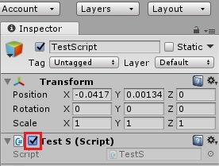

# Общие заметки

### Класс Object
[Документация](https://docs.unity3d.com/ru/current/ScriptReference/Object.html)

Базовый класс для всех объектов в Unity.


### Класс Component
[Документация](https://docs.unity3d.com/ru/current/ScriptReference/Component.html)

Базовый класс для всего что содержит в себе любой игровой объект(GameObject)

Порядок наследования: `Component -> Object`

### Класс GameObject
[Документация](https://docs.unity3d.com/ru/current/ScriptReference/GameObject.html)

Базовый класс для всех объектов на сценах Unity.

Порядок наследования: `GameObject -> Object`

### Класс MonoBehavior
[Документация](https://docs.unity3d.com/ru/current/ScriptReference/MonoBehaviour.html)

Базовый класс, от которого наследуются все скрипты.

Порядок наследования: `MonoBehavior -> Behavior -> Component -> Object`

Класс MonoBehavior имеет ряд функций "сообщений", которые вызываются при определенных условиях. Пример функций: ***Start(), Update()***  



Флажок выключающий MonoBehavior в любом скрипте предотвращает выполнение функций:  
***Start(), Awake(), Update(), FixedUpdate(), OnGUI()***

### Наследование в C#
Синтаксис наследование:`public class ChildClass : ParentClass`

### Полиморфизм в С#
* Во время выполнения объекты производного класса могут обрабатываться как объекты базового класса
* Базовые классы могут определять и реализовывать виртуальные методы, а производные классы - переопределять их:
``` C#
// Реализация виртуального метода родительского класса
public class BaseHelloClass {
	public virtual void SayHello(){ // родительский метод SayHello
		Debug.log("Hello");
	}
}
//-----------------------------------------------
// Производный класс может переопределить член базового класса, только если 
// последний будет объявлен виртуальным или абстрактным.

public class ChildHelloClass : BaseHelloClass {
	public override void SayHello(){ // переопределенный метод SayHello
		Debug.log("Hello in child class");
	}
}
```
Внутри производного класса можно получить доступ к методам базового через `base` Пример:
``` C#
public class Base
{
    public virtual void DoWork() {/*...*/ }
}
public class Derived : Base
{
    public override void DoWork()
    {
        //Perform Derived's work here
        //...
        // Call DoWork on base class
        base.DoWork();
    }
}
```

### Интерфейсы в С#
Интерфейсы могут включить в класс поведение из нескольких источников. 
``` C#
interface ISampleInterface
{
    void SampleMethod();
}

public class ISampleClass : ISampleInterface
{
	void SampleMethod(){
		// ...
	}
}
```
Интерфейс содержит только сигнатуры методов, свойств, событий или индексаторов.

## Отладка в Unity

### Debug
Самый простой способ отладки, использовать класс Debug, который выводит сообщения в консоли редактора:
``` C#
Debug.Log("Some text");
Debug.Error("Errore text");
```

### Переопределение метода ToString()
``` C#
public override string ToString(){
	return string.Format ("***Class EnemyOgre*** OgreName:{0} | Health: {1} | 
		Speed : {2} | CurrentAttack : {3} | RecoveryTime: {4}", OgreName, Health, 
		Speed, CurrentAttack, RecoveryTime);
}
```

### Визуальная отладка
Визуальная отладка осуществляется с помощью класса Gizmo и метода MonoBehavior.OnDrawGizmos()
``` C#
public class GizmoCube : MonoBehavior{
	public bool DrawGizmos = true;

	void OnDrawGizmos(){
		if(!DrawGizmos) return;

		Gizmos.color = Color.blue;

		Gizmos.DrawRay(transform.position, transform.forward.normalized * 4.0f);

		Gizmos.color = Color.red;
		Gizmos.DrawWireSphere(transform.position, 4.0f);

		Gizmos.color = Color.white;
	}
}
```

### Регистрация ошибок в текстовый файл
``` C#
public class ExceptionLogger : MonoBehavior{
	// Внутрення ссылка на объект потока записи
	private System.IO.StreamWriter SW;

	// Имя файла регистрации
	public string LogFileName = "log.txt";

	void Start(){
		// Сделать постоянно хранимым в памяти
		DontDestroyOnLoad(gameObject);

		// Создать объект записи в строку
		SW = new System.IO.StreamWriter(Application.persistentDataPath + "/" + LogFileName);

		Debug.Log(Application.persistentDataPath + "/" + LogFileName);
	}

	// Зарегистрировать обработчик исключений
	void OnEnable(){
		Application.RegisterLogCallback(HandleLog);
	}

	// Отключить обработчик исключений
	void OnDisable(){
		Application.RegisterLogCallBack(null);
	}

	// Записать информацию об исключении в файл
	void HandleLog(String logString, string stackTrace, LogType type){
		// Если исключение ошибка, записать в файл
		if(type == LogType.Exception || type == LogType.Error){
			SW.WriteLine.Exception("Logged at: " + System.DateTime.Now.ToString() 
			+ " - Log Desc: " + logString + " - Trace : " + stackTrace + 
			" - Type: " + type.ToString());
		}
	}
	// Вызывается при унижчтожении объекта
	void OnDestroy() {
		// Закрыть файл
		SW.Close();
	}
}
```

### Profiler (профайлер)
[Documentation](https://docs.unity3d.com/ru/520/Manual/Profiler.html)

Профайлер Unity помогает вам оптимизировать вашу игру. Он сообщает вам о том, как много времени тратится в различных областях вашей игры.

## Функции поиска

### Функция GetComponent
[Documentation](https://docs.unity3d.com/ru/current/ScriptReference/GameObject.GetComponent.html)

Функция получающая компонент объекта по его типу.
``` C#
Transform myTrans = GameObject.GetComponent<Transform> ();
```

### Функция GetComponents
[Documentation](https://docs.unity3d.com/ru/current/ScriptReference/GameObject.GetComponents.html)

Функция получает несколько компонентов по типу
``` C#
// Получить все компоненты
private Component[] AllComp = null;

void Start(){
	// Получить список всех компонентов данного объекта
	AllComp = GetComponents<Component> ();
}
```

### Функции Find и FindWithTag
[Documentation Find](https://docs.unity3d.com/ru/current/ScriptReference/GameObject.Find.html)
[Documentation FindWithTag](https://docs.unity3d.com/ru/current/ScriptReference/GameObject.FindWithTag.html)

Поиск объектов в сцене. Первый ищет по имени объекта, второй по тегу. ***Второй способ быстрее!***

### Функция сравнения тегов CompareTag
[Documentation GameObject](https://docs.unity3d.com/ru/current/ScriptReference/GameObject.html)
``` C#
gameObject.CompareTag(Obj2.tag);
```

### Функция сравнения двух объектов GetInstanceID
[Documentation GameObject](https://docs.unity3d.com/ru/current/ScriptReference/GameObject.html)
``` C#
if(obj1.GetInstanceID() == obj2.GetInstanceID()){
	...
}
```

### Расстояние между двумя объектами
[Documentation Vector3.Distance](https://docs.unity3d.com/ru/current/ScriptReference/Vector3.Distance.html)
``` C#
float distance = Vector3.Distance(obj1.transform.position, obj2.transofrm.position)
```

### Поиск объектов определенного типа
***Не использовать в Update()***
``` C#
Collider[] Cols = Object.FindObjectsOfType<Collider>();
```

### Проверка препятствий между объектами
[Documentation Physics.LineCast](https://docs.unity3d.com/ru/current/ScriptReference/Physics.Linecast.html)
``` C#
public LayerMask LM;

void Update(){
	if(!Physics.LineCast(obj1.transform.position, obj2.transform.position, LM)){
		Debug.log("Препятствий нет");
	}
}

// Показывать вспомогательную линию в режиме отладки
void OnDrawGizmos(){
	Gizmos.DrawLine(obj1.transform.position, obj2.transform.position);
}
```

### Присоединение одного объекта к другому с помощью Transform
``` C#
childObj.transform.parent = parentObj.transform;
```

## Работа с кадрами в Unity
Для работы с кадрами имеются три основных вида событий в любом классе MonoBehavior.
- Update()
- FixecUpdate()
- LateUpdate()

[Documentation Physics.LineCast](https://docs.unity3d.com/ru/current/ScriptReference/MonoBehavior.html)

### Update
Вызывается один раз для каждого кадра в каждом активном компоненте каждого активного объекта. Update соответствует понятию кадра в Unity. Используется для событий ввода: клавиатура, мышь. Очередность обработки Update не определена. Нельзя утверждать, что Update Х будет вызван раньше чем Update Y и наоборот.

### FixedUpdate
Не привязано к кадрам. Может вызываться несколько раз в кадре. Вызывается регулярно и нормированно, через фиксированные интервалы времени. Используется для эмуляции физических характеристик объектов(св-ва компонента RigidBody)

### LateUpdate
Вызывается в каждом кадре как и Update, но только после событий Update и FixedUpdate. Используется для изменения положения камеры, т.к. положение объекта уже было изменено в Update

### Start
Вызывается один раз в первом кадре, где игровой объект становится активным.

### Awake
Вызывается один раз, всегда при создании объекта, всегда перед функцией Start

### Два важных правила в работе с кадрами
1. Важно рационально относиться к Update и любым другим регулярным вызываемым событиям, связанным с кадрами. Они должны содержать только самый необходимый код. ***Серьезно уменьшить нагрузку на функции Update поможет событийное программирование.***
2. Движение должно основываться на времени. То есть нужно писать код для реализации движений и изменений так, чтобы вне зависимости от частоты кадров они выглядели одинаково у всех игроков.***Для этого используется переменная Time.deltaTime***  
`transform.localPosition += transform.forward * Speed * Time.deltaTime;`

### Неуничтожаемые объекты
По умолчанию объекты не могут существовать вне сцены, которой они принадлежат, они уничтожаются при смене активной сцены.

Чтобы перенести объект из сцены в сцену, необходимо его сохранять. Одним из способов сохранения является функция DontDestroyOnLoad: `DontDestroyOnLoad(gameObject);`  
При этом также будут сохраняться все дочерние объекты и любые ресурсы которые использует сохраняемый объект. Также может возникнуть проблема дублирования объектов, т.к. данная функция переносит копию объекта.

### Синглтоны и статические переменные
Синглтоны это классы у которых может существовать только один экземпляр. Такие классы используются в Unity для переноса данных из сцены в сцену. Пример реализации синглтона GameManager:
``` C#
public class GameManager : MonoBehavior{
	// Свойство С# дя доступа к экземпляру синглтона
	// Доступно только для чтения - метод set отсутствует
	public static GameManager Instance{
		// вернуть ссылку на экземпляр
		get {
			return instance;
		}
	}

	private static GameManager instance = null;

	// Наибольший результат в игре
	public int HighScore = 0;

	// Признак приостановки игры
	public bool IsPaused = false;

	// Признак поддержки ввода пользователя
	public bool InputAllowed = true;

	// Метод инициализации
	void Awake (){
		// Проверить наличие экземпляра класса
		// Если присутствует - уничтожить текущий экземпляр
		if(instance){
			DestroyImmediate(gameObject);
			return;
		}
		// Сделать актиным и единственным данный экземпляр
		instance = this;

		// Сделать диспетчер игры неуничтожаемым
		DontDestroyOnLoad(gameObject);
	}
}
```

## Событийное программирование в Unity
Используется для значительного увеличения производительности, заместо постоянного использования функции Update

### Два варианта реализации логики врага
1. Через функцию Update :
``` C#
void Update(){
	// Проверить здоровье врага
	if(Health <= 0){
		// Сымитировать смерть
		Die();
		return;
	}
	// Уровень здоровья слишком низкий ?
	if(health <= 20){
		// Уровень низкий, отправиться на поиски аптечки
		RunAndFindHealthRestore();
		return;
	}
	// Проверить патроны
	// Патроны кончились ?
	if(Ammo <= 0){
		// Отправиться на поиски патронов
		SearchMore();
		return;
	}
	// Здоровье в порядке, патроны есть.
	// Игрок в поле зрения ? Если да - выстрелить
	if(HaveLineOfSight){
		FireAtPlayer();
	}
}
```
2. Событийная реализация логики врага : 
``` C#
// Внутренние закрытые переменные: уровень здоровья и количество патронов
private int _health = 100;
private int _ammo = 50;
//--------------------
// Свойства C# для закрытых переменных
public int Health{
	get{
		return _health;
	}
	set{
		// Привести уровень здоровья в диапозоне 0-100
		_health = Mathf.Clamp(value, 0, 100);

		// Убит ?
		if(_health <= 0){
			OnDead();
			return;
		}

		// Проверить уровень здоровья
		// и сгенерировать событие при необходимости
		if(_health <= 20){
			OnHealthLow();
			return;
		}
	}
}
//--------------------
public int Ammo{
	get{
		return _ammo;
	}
	set{
		// Привести боезапас в диапазон 0-50
		_ammo = Mathf.Clamp(value, 0, 50);

		// Проверить отсутствие патронов
		if(_ammo <= 0){
			// Вызвать событие опустошения боезапаса
			OnAmmoExpired();
			return;
		}
	}
}
//--------------------
void Update(){

}

// Событие при низком уровне здоровья
void OnHealthLow(){
	// Реализация отклика на событие
}

// Событие когда враг умирает
void OnDead(){
	// Реализация отклика на событие
}

// Событие когда заканчиваются патроны
void OnAmmoExpired(){
	// Реализация отклика на событие
}
```

### Система управления событиями EventManager
Для подобной системы нам нужен произвольный класс управления EventManager, который позволит объектам получать уведомления о конкретных событиях. Эта система основана на трех основных идеях:

1. *EventListener*: "получатель событий" применимо к любому объекту, который должен получать уведомления о событии, даже если это событие связано с ним самим. Всякий раз, когда объект ожидает, что ему сообщат о событии, он становится получателем.
2. *EventPoster*: объект, который обнаруживает, что произошло событие, после чего он должен уведомить всех получателей, или разместить объявление о событии. Требуется, чтобы объект инициировал события на глобальном уровне.
3. *EventManager*: синглтон, который сохраняется при переходе между уровнями и доступен глобально. Связывает получателей с отправителями. Принимает уведомления о событиях, и сразу же передает их нужным получателям в форме события.

### EventListener(получатель) 
Должен быть зарегистрирован в *EventManager* в качестве получателя одного или более конкретных событий. Необходимо создать интерфейс, из которого мы будем обращаться ко всем объектам получателей.  
Интерфейс в C# является подходящим кандидатом для создания объектов получателей.  
С помощью интерфейса *Listener*, от которого будут произведены все объекты, каждый объект получает возможность стать получателем события.  
Простой интерфейс *Listener* :
``` C#
// Перечисление определяет все возможные события
// Дополнительные события должны добавляться сюда
public enum EVENT_TYPE {GAME_INIT,
												GAME_END,
												AMMO_EMPTY,
												HEALTH_CHANGE,
												DEAD};
//------------------------------------------------
// Интерфейс Listener для реализации в классах получателей событий
public interface IListener{
	// Вызывается, когда возникает событие
	void OnEvent(EVENT_TYPE Event_Type, Component Sender, Object Param = null);
}

```

С помощью интерфейса IListener мы можем сделать получателем любой объект, используя только наследование класса, то есть любой объект может объявить себя получателем и получать события:
``` C#
public class MyCustomListener : MonoBehavior, IListener {
	void Start() {}
	void Update() {}

	// Реализовать функцию OnEvent для приема событий
	public void OnEvent(EVENT_TYPE Event_type, 
											Component Sender, Object Param = null) {
		//....
	}
}
```

### EventManager(синглтон менеджер)
